# Sentire Cloud: System Design

**Version 1.2, 25 November 2026.** Version 1.2 records the owner's decisions (Sentire is the only seller; no client migration). Version 1.1 added the paywall: feature-level gating, the upgrade flow from inside any app, upgrade requests, usage-limit paywalls and feature trials (FR-44 to FR-51, UC-13, UC-14). Companion documents: Build Plan, Blueprint, CLAUDE.md, README.md.

**What Sentire Cloud is.** Sentire Cloud is the centre of every Sentire app. It holds the things that belong to a client company rather than to one app:

- **Sentire Account:** one sign-in for every app, and the organization (client company) with its members.
- **Billing:** the product catalog, subscriptions, entitlements, billing statements, payments and collections.
- **Connections:** the app registry, the event hub that carries messages between apps, and machine credentials for app-to-app calls.
- **Hosting:** each client's app instances, the servers they run on, status, backups and provisioning.

Each product (Ledger, Payroll, Projects, Helpdesk, LMS, PMS) keeps its own database and its own business data. Sentire Cloud never stores a client's books, payroll or tickets.

**Tenancy, users and paywall.** Sentire Cloud is multi-tenant, multi-user software with a paywall:

- **Multi-tenant:** each client company is one tenant (an organization). Every tenant-owned record carries the organization, and no tenant can read another's data.
- **Multi-user:** a person has one Sentire Account and can belong to many organizations, with a different role in each (for example an accountant who serves several clients).
- **Paywall:** what each organization may use, down to single features and usage limits, follows what it has paid for. A locked feature shows an upgrade card in every app, the right person can pay on the spot, and the feature unlocks within a minute. Apps enforce the paywall on their servers, not only on screen.

**How to read this document.** Section 1 states what the system must do and how well. Section 2 names who uses it. Section 3 describes the top use cases step by step. Section 4 gives the class model. Section 5 gives the activity diagrams for the main workflows. Section 6 adds supporting views (state machines, deployment, design rules). Requirement IDs (FR, NFR, CR) are referenced by the Build Plan and by UAT documents.

**Priority key.** MVP = needed before Sentire Ledger's first paying client is billed through Sentire Cloud. P2 = second release. Later = after product-market fit.

---

## 1. System Requirements

### 1.1 Functional requirements

#### Sentire Account (identity)

| ID | Requirement | Priority |
|---|---|---|
| FR-01 | A person can create a Sentire Account with email and password, verify the email, and sign in. Passwords are checked against a breached-password list and a minimum length of 12. | MVP |
| FR-02 | A user can turn on two-factor sign-in with an authenticator app (TOTP) or a passkey, and keep one-time recovery codes. Owners and Sentire staff must use two-factor sign-in. | MVP |
| FR-03 | Sentire Cloud is the OpenID Connect provider for every Sentire app. A signed-in user opens any app they have access to without signing in again (single sign-on), and signing out of Sentire Cloud signs them out of every app (back-channel logout). | MVP |
| FR-04 | A user can reset a forgotten password by email link, see their active sessions and devices, and end any of them. | MVP |
| FR-05 | Every app shows the Sentire app switcher (from sentire-kit), listing only the apps the user can open for the current organization. | MVP |
| FR-06 | A user can sign in with Google or Microsoft as an alternative to a password. | P2 |

#### Organizations and members

| ID | Requirement | Priority |
|---|---|---|
| FR-07 | A user can create an organization (client company) with registered name, trade name, TIN and branch code, business address, VAT registration status, industry, billing email and phone. The creator becomes its Owner. | MVP |
| FR-08 | A user can belong to several organizations and switch between them; each app opens in the organization chosen. | MVP |
| FR-09 | An Owner or Admin can invite people by email, set their organization role (Owner, Admin, Billing, Member) and choose which apps each member may open. App-level roles (for example Ledger's Accountant) stay inside each app. | MVP |
| FR-10 | An Owner or Admin can remove a member or change their role; removal ends the member's sessions in every app within 60 seconds. | MVP |
| FR-11 | An Owner can transfer ownership to another member. An organization always has at least one Owner. | MVP |
| FR-12 | An accounting firm can be linked to several client organizations as an outside adviser, with access granted and revoked by each client's Owner. | P2 |

#### Product catalog and billing

| ID | Requirement | Priority |
|---|---|---|
| FR-13 | Sentire staff maintain a product catalog: products, plans (tiers), prices (monthly and annual, in PHP centavos), setup fees, add-ons, bundles and limits per plan (for example Ledger Solo: 1 user, 1 company, 1 branch, 150 invoices a month). Prices are versioned; a price change never alters an existing subscription until renewal. | MVP |
| FR-14 | An Owner or Billing member can subscribe the organization to a plan, with optional add-ons, and pay by card, GCash or Maya through the provider's hosted checkout, or choose bank transfer with a due date. | MVP |
| FR-15 | Sentire Cloud creates a billing statement for every charge (setup fee, first period, renewal, add-on, usage), numbered in its own series, and records every payment against it. The BIR invoice is issued as set out in CR-01. | MVP |
| FR-16 | Subscriptions renew automatically at the end of each period. A saved card or wallet is charged where the provider supports it; otherwise a payment link is emailed 7 days before the due date. | MVP |
| FR-17 | When a payment fails or is late, Sentire Cloud runs the dunning schedule (reminders on day 0, 3 and 7), then sets the subscription to Suspended (apps become read-only) and, after 30 days, to Cancelled. Paying the balance at any point before cancellation reactivates it at once. | MVP |
| FR-18 | An Owner or Billing member can upgrade, downgrade, add or remove add-ons and cancel. Upgrades take effect at once with a prorated charge; downgrades and cancellations take effect at the end of the paid period. | MVP (cancel, upgrade), P2 (proration of add-ons) |
| FR-19 | A client that withholds tax on its payment (for example 2% expanded withholding tax) can record the payment net of withholding. The withheld amount stays as "2307 pending" until the certificate (BIR Form 2307) is uploaded and accepted by Sentire staff. | MVP |
| FR-20 | Sentire staff can record bank transfers and match them to statements, issue credit notes and refunds, and waive or adjust a charge with a reason (logged). | MVP |
| FR-21 | Apps report metered usage (for example AI tokens, SMS sent, extra storage) to Sentire Cloud; usage beyond the plan's allowance is charged on the next statement at the catalog rate. | P2 |
| FR-22 | Owners see a billing page: current plan per app, next renewal, statements, payments, 2307 status and saved payment methods, and can download any statement as PDF. | MVP |
| FR-23 | Trials, pilots and promo codes: a plan can offer a paid pilot (for example Ledger's 14-day pilot credited to setup) or a percentage or fixed promo for a set number of periods. | P2 |

#### Entitlements

| ID | Requirement | Priority |
|---|---|---|
| FR-24 | For every organization and app, Sentire Cloud computes the entitlement: whether the app is active, read-only or off, the plan, the add-ons, and the limits. | MVP |
| FR-25 | An app reads its entitlement through the entitlement API or from a signed entitlement token, and is told of every change by an `account.entitlement.changed` event within 60 seconds. | MVP |
| FR-26 | Apps enforce the limits themselves (they hold the data) and report current counts (users, branches, invoices this month) so Owners and staff see usage against the plan. | MVP |

#### Paywall and feature gating

| ID | Requirement | Priority |
|---|---|---|
| FR-44 | Sentire staff define features in the catalog: a stable key (for example `ledger.bank_reconciliation`, `ai.assistant`), a name, a one-line benefit, the product, and which plans and add-ons include it. A feature can also carry a limit (for example AI requests a month). | MVP |
| FR-45 | The entitlement lists the features turned on for the organization and app, each with its source (plan, add-on, trial or staff override), and every limit with its mode: soft (warn only), hard (block) or overage (charge for extra use). | MVP |
| FR-46 | When a user opens or calls a locked feature, the app shows the Sentire upgrade card: feature name and benefit, the cheapest plan or add-on that unlocks it and its price. An Owner or Billing member sees **Upgrade**; everyone else sees **Ask my Owner**. | MVP |
| FR-47 | **Upgrade** opens Sentire Cloud checkout already filled in with the plan or add-on and a return address. After payment the user is sent back to the same place in the app, and the feature is unlocked within 60 seconds. | MVP |
| FR-48 | **Ask my Owner** sends an upgrade request (feature, requester, optional note). Owners and Billing members are told in Sentire Cloud and by email, and can approve (which opens checkout) or decline with a reason; the requester is told the result. Repeat requests for the same feature within 7 days are merged. | MVP |
| FR-49 | **Limit paywall.** At 80% of a limit the app shows a warning to Owners and Admins; at 100% a hard limit blocks new items with the upgrade card, a soft limit only warns, and an overage limit allows extra use charged on the next statement at the catalog rate. Existing data is never hidden or deleted because of a limit. | MVP (warn and block), P2 (overage) |
| FR-50 | Staff can give an organization a time-limited trial of a paid feature or add-on (default 7 days), once per organization per feature. When it ends the feature locks again unless bought; anything created during the trial stays readable. | P2 |
| FR-51 | Staff see paywall figures per feature: upgrade cards shown, Upgrade clicks, requests, approvals and purchases. | P2 |

#### Connections between apps

| ID | Requirement | Priority |
|---|---|---|
| FR-27 | Sentire staff register each app and its instances (app registry): name, base URL, OIDC client, the event types it sends and accepts, and its health URL. | MVP |
| FR-28 | An Owner or Admin can turn on a connection between two of the organization's apps (for example Payroll to Ledger, Ledger to Projects), choosing which event types flow. Both apps are told, and nothing flows until the connection is on. | P2 |
| FR-29 | The event hub receives signed events (sentire.event.v1) from apps, checks the signature, the organization, the connection and the entitlement, and delivers them to each subscribed app with retries (1 min, 5 min, 30 min, 2 h, 12 h). Each delivery is recorded with its result. | P2 |
| FR-30 | Owners and staff can see the delivery log of their connections and resend a failed event. | P2 |
| FR-31 | An app can obtain a short-lived machine token (OAuth client credentials) scoped to one organization and a set of scopes, to call another Sentire app's API on that organization's behalf. | P2 |
| FR-32 | Sentire Cloud itself publishes account events: organization created and updated, member added, changed and removed, subscription and entitlement changed. | MVP |

#### Hosting and instances

| ID | Requirement | Priority |
|---|---|---|
| FR-33 | Each organization's use of an app is an instance: shared (a site in the app's shared deployment, for example a Ledger site in the multi-site container) or dedicated (its own servers, for example Ledger Enterprise or a Philippine-hosted server). | MVP |
| FR-34 | When a subscription starts, Sentire Cloud provisions the instance by calling the app's provisioning endpoint (shared) or by creating the app in Dokploy on the chosen server (dedicated), then records the instance URL and status. | MVP (shared), P2 (dedicated) |
| FR-35 | Sentire Cloud keeps the status page (today's console): every product and platform service checked every 60 seconds, with uptime history per service and incident notes. Clients see a public status page; staff see all detail. | MVP |
| FR-36 | Sentire Cloud records each instance's backups (time, size, location, last restore test) as reported by the app or the backup job, and alerts staff when a backup is missing for more than 26 hours. | P2 |
| FR-37 | Sentire staff can register servers (Contabo, ALC Hosting MNL, MNL2, CRK) with region, size and monthly cost, and see which instances run on each. | P2 |

#### Offboarding, support and administration

| ID | Requirement | Priority |
|---|---|---|
| FR-38 | When a subscription is cancelled, Sentire Cloud asks the app for a full data export, makes it available to the Owner for 30 days, then asks the app to delete the data and stores the deletion certificate. | MVP (for Ledger, which already has export and certificate) |
| FR-39 | Sentire staff have an admin console: organizations, members, subscriptions, statements, payments, 2307s, instances, servers, connections, events and the audit log, with search. | MVP |
| FR-40 | Staff access to a client's data inside an app needs the Owner's consent, is time-limited (default 2 hours), and is logged in Sentire Cloud and in the app. | P2 |
| FR-41 | Every sign-in, permission change, billing action, provisioning step and staff action is written to an append-only audit log. Owners see their organization's log. | MVP |
| FR-42 | Sentire Cloud sends transactional email through Postal (verification, invitations, statements, receipts, dunning, incidents) and SMS through Semaphore for two-factor fallback and payment reminders. | MVP (email), P2 (SMS) |
| FR-43 | Staff see business figures: MRR and ARR by product, active organizations, churn, ARPU, overdue balances, 2307s pending, and (with FR-21) AI cost against AI revenue per organization. | P2 |

### 1.2 Non-functional requirements

| ID | Category | Requirement |
|---|---|---|
| NFR-01 | Availability | Sign-in and token endpoints target 99.9% monthly uptime, because every app depends on them. Billing pages and the admin console target 99.5%. |
| NFR-02 | Resilience of apps | An app keeps working for signed-in users if Sentire Cloud is briefly down: sessions already issued stay valid until they expire (access token 10 minutes, refresh up to 12 hours), and entitlements are cached for 24 hours. An outage never makes an app lose data. |
| NFR-03 | Performance | Sign-in page and token endpoint answer in under 300 ms at the 95th percentile; entitlement API under 100 ms; portal pages under 1.5 s. |
| NFR-04 | Security | HTTPS only; HSTS; argon2id password hashes; session cookies HttpOnly, Secure, SameSite=Lax; CSRF protection; rate limits on sign-in, reset and invite; signing keys rotated every 90 days with the old key published until all tokens signed by it expire; secrets only in Dokploy environment variables. |
| NFR-05 | Card data | Card and wallet data never touch Sentire servers: provider-hosted checkout and tokens only (PCI DSS SAQ A level). |
| NFR-06 | Tenant isolation | Every client-owned row carries `organization_id`; every query goes through a data-access layer that requires the current organization; integration tests prove one organization cannot read another's data. |
| NFR-07 | Money | All amounts in integer centavos (bigint), currency PHP; rounding half-up at the line level; statement totals are the sum of their lines. |
| NFR-08 | Exactly-once effects | Payment webhooks, event deliveries and provisioning steps are idempotent: each has a unique key, and a repeat is acknowledged without doing the work twice. |
| NFR-09 | Auditability | The audit log, statements, payments and ledger entries are append-only at the application level and protected by a database trigger. Corrections are reversals or credit notes. |
| NFR-10 | Durability | Nightly encrypted Postgres backups kept 30 days, plus an off-server copy on RustFS; restore tested monthly. Recovery point 24 h (with WAL archiving in P2: 15 min); recovery time 4 h. |
| NFR-11 | Data residency | Client account and billing data are stored on Sentire's own servers. When the Philippine-hosting decision (Ledger D3, LDG-54) is made, Sentire Cloud moves with it. |
| NFR-12 | Observability | Structured logs with request IDs, error tracking, a health endpoint, and metrics for sign-ins, token issues, webhook lag and event delivery lag. |
| NFR-13 | Time | Store UTC; show Asia/Manila; billing periods and due dates are calendar dates in Manila time. |
| NFR-14 | Usability | Works on current Chrome, Edge, Safari and Firefox, and on phones; WCAG 2.1 AA for contrast and keyboard use; Sentire Designs tokens. |
| NFR-15 | Maintainability | TypeScript strict mode; unit tests for billing and entitlement rules; integration tests per use case; Playwright tests for sign-up, SSO, checkout and dunning; every process ships with a UAT document (Sentire UAT Standard). |
| NFR-16 | Cost | Runs on the existing Dokploy app server and shared Postgres. Added running cost under PHP 1,000 a month before payment fees (estimate). |
| NFR-17 | Standards | OpenID Connect Core 1.0 with discovery, PKCE for every client, back-channel logout; JWT access tokens signed with ES256. |
| NFR-18 | Paywall enforcement | Every locked feature is refused on the app's server, not only hidden on screen. A refused call answers HTTP 402 with code `PAYMENT_REQUIRED`, the feature key and the upgrade address, so any screen or API client can show the upgrade card. |
| NFR-19 | Paywall consistency | The upgrade card is one shared component (sentire-kit for Next.js apps, a Sentire Framework page include for Frappe apps), so it looks and behaves the same in every app. |
| NFR-20 | Paywall speed | Checking whether a feature is on takes under 1 ms inside the app (from the cached entitlement), never a network call per check. |

### 1.3 Compliance requirements (Philippines)

These are design obligations, not legal advice. Each is confirmed against current rules before launch.

| ID | Requirement |
|---|---|
| CR-01 | **BIR invoices for Sentire's own sales.** Under the EOPT Act (RA 11976) the invoice is the primary document for the sale of services. A system that issues invoices must be registered with the BIR. Until Sentire Cloud is registered, it issues **billing statements** only, and each BIR invoice is issued from Sentire's own registered system (its own Sentire Ledger company) through the event hub (`billing.statement.paid` creates the invoice there) or from BIR-registered invoice booklets. The statement shows the invoice number once issued. |
| CR-02 | **Seller tax status.** The selling entity is non-VAT today (gross sales under PHP 3 million; 3% percentage tax). Statements and invoices follow the seller's registration (non-VAT wording, no VAT line), and the seller profile can be switched to VAT-registered without code changes when the threshold is crossed. |
| CR-03 | **Withholding by clients.** Corporate clients may withhold creditable tax on payments for services and issue BIR Form 2307. Sentire Cloud records the expected withholding, tracks the certificate, and reports 2307s received per quarter for Sentire's own returns. |
| CR-04 | **Data Privacy Act (RA 10173).** Sentire is the personal information controller for account and billing data, and a processor for client data held in the apps. Collect only needed data, record consent for marketing email, honour access, correction and erasure requests, keep a breach response procedure (notify the NPC and affected people within 72 hours where required), and name a data protection officer. |
| CR-05 | **Payment data.** Hosted checkout and tokens only (NFR-05). |
| CR-06 | **Records retention.** Billing statements, payments and invoices are kept at least 10 years (Tax Code books and records rules as amended by EOPT; confirm the period), even after an organization is deleted; personal data in them is limited to what the records need. |

### 1.4 Constraints and assumptions

- One developer (the founder) building with Claude Code. Scope favours depth over breadth.
- Hosting: the existing Dokploy app server (Contabo), shared Postgres 18, RustFS object storage, Postal email. Philippine-hosted servers from ALC Hosting are added as Dokploy remote servers (CLD-3 to CLD-5).
- Payment providers: PayMongo and Maya for Business (hosted checkout, payment links, saved cards where offered, webhooks). Recurring-charge support of each provider is confirmed in a Phase 2 spike before it is relied on.
- Sentire Ledger (a Frappe app on Sentire Framework) is the first app to use Sentire Cloud. Frappe supports external OpenID Connect sign-in (Social Login Key), so Ledger needs configuration and a small ph_cas hook, not a framework change.
- The Next.js apps (Payroll, Projects, PMS) sign in through sentire-kit. sentire-kit's sign-in helpers currently point at a Frappe site as the provider; pointing them at Sentire Cloud is part of the later Sentire Framework enhancement.
- Each app keeps its own users table linked to the Sentire Account by the OIDC `sub`, and keeps its own app roles.

---

## 2. System Actors

### 2.1 Human actors

| Actor | Who | Main goals | Access |
|---|---|---|---|
| Prospect | A business owner or staff member who has not signed up | Learn the plans, create an account, start a subscription | Public pages, sign-up |
| Organization Owner | The client company's owner or the person who signed up | Run the account: plans, payment, members, connections, data export | Everything for their organization |
| Organization Admin | Office manager or IT person | Invite and manage members, app access, connections | Members, apps, connections; billing read-only |
| Billing Contact | Client's bookkeeper or accountant | Pay, download statements, upload 2307s | Billing pages only |
| Member | Any staff user of the client | Sign in once, open the apps they are allowed, ask for locked features | Own profile, security, app launcher, upgrade requests |
| Sentire Platform Admin | The founder (later, Sentire staff) | Catalog, billing operations, provisioning, servers, incidents | Admin console, all organizations (audited) |
| Sentire Support Agent | Support staff (later) | Help clients without seeing their data unless consented | Admin console read-only; consented app access |

### 2.2 System actors

| Actor | Role |
|---|---|
| Sentire Apps (Ledger, Payroll, Projects, Helpdesk, LMS, PMS) | Relying parties for sign-in; read entitlements; send and receive events; expose provisioning, export and delete endpoints; report usage and backups |
| Payment Providers (PayMongo, Maya for Business) | Hosted checkout, payment links, saved payment methods, refunds, signed webhooks |
| Sentire's registered invoicing system (Sentire's own Ledger company) | Issues the BIR invoice for each paid statement (CR-01) |
| Dokploy | Creates, deploys and restarts dedicated instances; reports deployment status |
| Postal | Sends transactional email |
| Semaphore | Sends SMS (P2) |
| RustFS | Stores statement PDFs, 2307 uploads, data exports and backups |
| Scheduler (pg-boss) | Renewals, dunning, event retries, status checks, key rotation, backup checks |
| Hosting providers (Contabo, ALC Hosting) | Run the servers |

### 2.3 Actors and the parts of the system they use

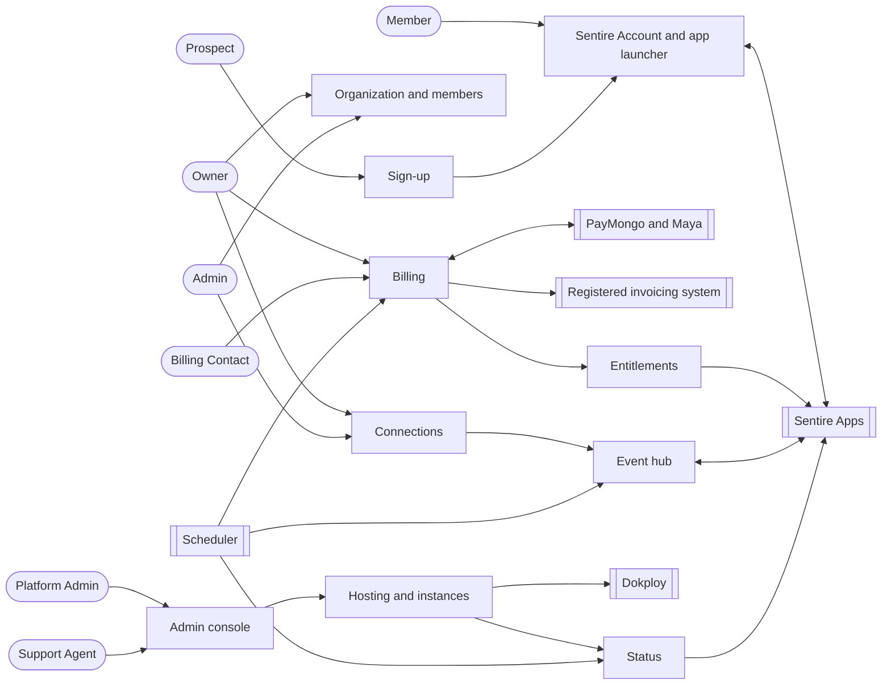
```mermaid
flowchart LR
  PR([Prospect]) --> SU[Sign-up]
  OW([Owner]) --> ORG[Organization and members]
  OW --> BILL[Billing]
  OW --> CON[Connections]
  AD([Admin]) --> ORG
  AD --> CON
  BC([Billing Contact]) --> BILL
  ME([Member]) --> ID[Sentire Account and app launcher]
  PA([Platform Admin]) --> ADM[Admin console]
  SA([Support Agent]) --> ADM
  SU --> ID
  ID <--> APPS[[Sentire Apps]]
  BILL <--> PAY[[PayMongo and Maya]]
  BILL --> INV[[Registered invoicing system]]
  ENT[Entitlements] --> APPS
  BILL --> ENT
  CON --> HUB[Event hub]
  HUB <--> APPS
  ADM --> HOST[Hosting and instances]
  HOST --> DOK[[Dokploy]]
  HOST --> STAT[Status]
  STAT --> APPS
  SCH[[Scheduler]] --> BILL
  SCH --> HUB
  SCH --> STAT
```

---

## 3. Top Use Cases

### 3.1 Use case overview

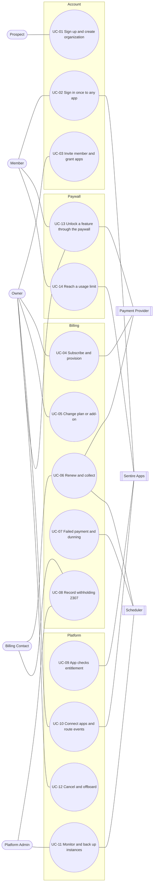
```mermaid
flowchart LR
  PR([Prospect])
  OW([Owner])
  BC([Billing Contact])
  ME([Member])
  PA([Platform Admin])
  subgraph S1[Account]
    direction TB
    UC1((UC-01 Sign up and create organization))
    UC2((UC-02 Sign in once to any app))
    UC3((UC-03 Invite member and grant apps))
  end
  subgraph S2[Billing]
    direction TB
    UC4((UC-04 Subscribe and provision))
    UC5((UC-05 Change plan or add-on))
    UC6((UC-06 Renew and collect))
    UC7((UC-07 Failed payment and dunning))
    UC8((UC-08 Record withholding 2307))
  end
  subgraph S3[Platform]
    direction TB
    UC9((UC-09 App checks entitlement))
    UC10((UC-10 Connect apps and route events))
    UC11((UC-11 Monitor and back up instances))
    UC12((UC-12 Cancel and offboard))
  end
  subgraph S4[Paywall]
    direction TB
    UC13((UC-13 Unlock a feature through the paywall))
    UC14((UC-14 Reach a usage limit))
  end
  APPS[[Sentire Apps]]
  PAY[[Payment Provider]]
  SCH[[Scheduler]]
  PR --- UC1
  ME --- UC2
  OW --- UC3
  OW --- UC4
  OW --- UC5
  BC --- UC6
  BC --- UC8
  OW --- UC10
  OW --- UC12
  PA --- UC8
  PA --- UC11
  UC2 --- APPS
  UC4 --- PAY
  UC6 --- PAY
  UC6 --- SCH
  UC7 --- SCH
  UC9 --- APPS
  UC10 --- APPS
  UC11 --- SCH
  ME --- UC13
  OW --- UC13
  ME --- UC14
  UC13 --- PAY
  UC14 --- APPS
```

### 3.2 Use case descriptions

#### UC-01 Sign up and create an organization

- **Actors:** Prospect (primary), Postal.
- **Requirements:** FR-01, FR-02, FR-07, FR-41, CR-04.
- **Preconditions:** None.
- **Main flow:**
  1. Prospect opens Sign up from a product page or cloud.sentire.solutions.
  2. Prospect enters name, email and password, and accepts the terms and privacy notice (marketing consent is a separate, unticked box).
  3. System checks the password, creates an unverified account and emails a verification link.
  4. Prospect opens the link; the account is verified and signed in.
  5. System asks for the organization: registered name, trade name, TIN and branch code, address, VAT status, industry, billing email and phone.
  6. System creates the organization with the user as Owner, writes the audit entry and publishes `account.organization.created`.
  7. System shows the plans for the product the prospect came from (UC-04).
- **Alternate flows:**
  - 3a. Email already has an account: system offers sign-in and password reset instead; it does not reveal whether the email exists beyond what the reset flow already shows.
  - 4a. Link expired (24 hours): system sends a new link.
  - 5a. The TIN and branch already belong to another organization: system lets the user continue but flags it for staff review (a firm may manage several entities; a duplicate may also be a mistake).
- **Postconditions:** Verified Sentire Account; organization with one Owner; no subscription yet.

#### UC-02 Sign in once to any app (single sign-on)

- **Actors:** Member (primary), Sentire App.
- **Requirements:** FR-03, FR-05, FR-08, FR-24, NFR-02, NFR-17.
- **Preconditions:** The app is registered as an OIDC client; the member has access to the app in the chosen organization.
- **Main flow:**
  1. Member opens an app (for example ledger.sentire.solutions) and is not signed in there.
  2. App redirects to Sentire Cloud with an authorization request (PKCE).
  3. If the member has no Sentire Cloud session, they sign in (password, then second factor if on). If they belong to several organizations, they choose one.
  4. System checks that the organization's entitlement for the app is Active or Read-only and that the member is allowed this app.
  5. System returns an authorization code; the app exchanges it for an ID token and access token carrying the user, organization, organization role and entitlement summary.
  6. App creates or updates its local user from the token and starts its own session.
- **Alternate flows:**
  - 4a. App is not in the subscription, or the member is not allowed: system shows "You don't have access to this app" with a link to the Owner.
  - 4b. Subscription suspended: sign-in succeeds with a read-only claim; the app shows a banner and blocks writes.
  - 3a. Too many failed attempts: account locked for 15 minutes and the user emailed.
- **Postconditions:** Member signed in to the app; sign-in recorded in the audit log.

#### UC-03 Invite a member and grant app access

- **Actors:** Owner or Admin (primary), Postal, Sentire Apps.
- **Requirements:** FR-09, FR-10, FR-32, FR-41.
- **Main flow:**
  1. Owner opens Members, chooses Invite, enters an email, an organization role and the apps the person may open.
  2. System checks seat limits per app against the entitlements (for example Ledger Solo allows 1 user).
  3. System emails an invitation link valid for 7 days.
  4. The invitee opens the link, signs in or creates an account, and accepts.
  5. System adds the membership and publishes `account.member.added` to each granted app, which creates the user with a default app role (or waits for an app admin to assign one).
- **Alternate flows:** 2a. Seat limit reached: system offers to upgrade the plan (UC-05) or to remove another member. 4a. Invitation expired or revoked: system tells the invitee to ask for a new one.
- **Postconditions:** Member can sign in to the granted apps (UC-02).

#### UC-04 Subscribe to a product and provision it

- **Actors:** Owner or Billing Contact (primary), Payment Provider, Sentire App, registered invoicing system.
- **Requirements:** FR-13 to FR-16, FR-24, FR-25, FR-33, FR-34, CR-01, CR-02.
- **Preconditions:** Organization exists; the product is in the catalog and on sale.
- **Main flow:**
  1. Owner picks a product, plan, billing cycle (monthly or annual) and add-ons.
  2. System shows the price, setup fee, first period and total, with the seller's tax wording.
  3. Owner chooses to pay online (card, GCash or Maya) or by bank transfer.
  4. System creates the subscription as Pending and a billing statement for the first charge.
  5. Online: system opens the provider's hosted checkout. The provider confirms payment by signed webhook.
  6. System records the payment, marks the statement Paid, sets the subscription Active and recomputes the entitlement.
  7. System provisions the instance (activity 5.3) and emails the Owner the app link.
  8. System publishes `billing.statement.paid`; the registered invoicing system issues the BIR invoice and returns its number, which is shown on the statement.
- **Alternate flows:**
  - 3a. Bank transfer: statement is emailed with bank details and due in 7 days; provisioning waits until staff record the transfer (FR-20), unless staff allow a pilot start.
  - 5a. Payment fails or is abandoned: subscription stays Pending for 24 hours, then is closed; nothing is provisioned.
  - 5b. Webhook arrives twice: second one is acknowledged and ignored.
  - 7a. Provisioning fails: subscription stays Active, instance Failed; staff are alerted and the job retries; the Owner sees "Setting up your app".
- **Postconditions:** Active subscription, paid statement, provisioned instance, entitlement published.

#### UC-05 Change plan or add-on

- **Actors:** Owner or Billing Contact.
- **Requirements:** FR-18, FR-24, FR-25.
- **Main flow:** Owner picks a new plan or add-on; system shows the effect (prorated charge now for upgrades; change at renewal for downgrades) and the limits that change; on upgrade the system charges the difference (UC-04 steps 4 to 6) and updates the entitlement at once; on downgrade it schedules the change for the renewal date and warns if current usage is above the new limits.
- **Alternate flows:** Usage above the new plan's limits at renewal: the downgrade still applies, the app goes read-only for the excess (for example extra users cannot sign in) until the Owner reduces usage or upgrades.

#### UC-06 Renew and collect

- **Actors:** Scheduler (primary), Payment Provider, Billing Contact.
- **Requirements:** FR-15, FR-16, FR-19, CR-03.
- **Main flow:**
  1. Seven days before the period ends, the scheduler creates the renewal statement (applying any scheduled plan change and metered usage).
  2. If a saved payment method exists, the system charges it on the due date; otherwise it emails a payment link.
  3. Payment succeeds: statement Paid, new period starts, invoice issued (CR-01), receipt emailed.
- **Alternate flows:** 2a. Client pays net of withholding: Billing Contact records the withholding and uploads the 2307 (UC-08). 3a. Payment fails: UC-07.

#### UC-07 Failed or late payment (dunning)

- **Actors:** Scheduler, Billing Contact, Platform Admin.
- **Requirements:** FR-17, FR-24, FR-25.
- **Main flow:** see activity diagram 5.5. Day 0: Past due, reminder. Day 3 and 7: reminders. Day 8: Suspended, apps read-only, Owner emailed. Day 30: Cancelled, offboarding starts (UC-12).
- **Alternate flows:** Payment at any time before cancellation reactivates at once; staff can extend the grace period with a reason.

#### UC-08 Record a withholding certificate (BIR Form 2307)

- **Actors:** Billing Contact (primary), Platform Admin.
- **Requirements:** FR-19, CR-03.
- **Main flow:**
  1. Billing Contact pays a statement and enters the amount withheld and the ATC.
  2. System records the payment plus a 2307-pending amount; the statement counts as paid for service purposes.
  3. Billing Contact uploads the signed 2307 for the quarter.
  4. Platform Admin checks payee TIN, amounts and period and accepts it.
  5. System marks the withholding Received and includes it in the quarterly 2307 report.
- **Alternate flows:** 3a. No 2307 within 30 days after the quarter: reminders; after 60 days, staff may bill the withheld amount as due. 4a. Certificate wrong: staff reject it with a reason; client uploads again.

#### UC-09 App checks entitlement and reports usage

- **Actors:** Sentire App (primary).
- **Requirements:** FR-24 to FR-26, FR-21, NFR-02.
- **Main flow:** At sign-in the app reads the entitlement claim; for long sessions it calls the entitlement API (cached 24 hours) and listens for `account.entitlement.changed`; it blocks actions beyond limits with an upgrade message; once a day (and at month end) it reports usage counts.
- **Alternate flows:** Sentire Cloud unreachable: the app uses the cached entitlement until it expires, then stays in its last state and alerts staff; it never deletes or hides data because of an outage.

#### UC-10 Connect two apps and route events

- **Actors:** Owner or Admin (primary), Sentire Apps.
- **Requirements:** FR-27 to FR-31.
- **Example:** Payroll to Ledger. When a payroll run is approved in Payroll, Ledger receives `payroll.run.approved` and creates a draft journal entry for the accountant to review.
- **Main flow:**
  1. Owner opens Connections, picks Payroll to Ledger and the event types offered.
  2. System checks both apps are active for the organization and the plan allows connections.
  3. System saves the connection and publishes `account.connection.enabled` to both apps.
  4. Payroll sends events to the event hub, signed with its app secret.
  5. Hub verifies the signature, organization, connection and entitlement, stores the event and delivers it to Ledger signed with Ledger's secret.
  6. Ledger answers 2xx; the delivery is recorded as Delivered.
- **Alternate flows:** 6a. Ledger fails or times out: retries on the schedule; after the last retry the delivery is Failed and the Owner and staff are alerted; Owner can resend once the cause is fixed. 5a. Connection off or app suspended: event stored as Not delivered with the reason.

#### UC-11 Monitor and back up instances

- **Actors:** Scheduler (primary), Platform Admin.
- **Requirements:** FR-35 to FR-37.
- **Main flow:** Every 60 s the scheduler checks each service and instance health URL and records the result; two failed checks in a row open an incident and alert the Platform Admin; recovery closes it. Each night apps report backups; a missing backup after 26 hours raises an alert. The public status page shows current state and recent incidents.

#### UC-12 Cancel and offboard

- **Actors:** Owner (primary), Sentire App, Scheduler.
- **Requirements:** FR-18, FR-38, CR-04, CR-06.
- **Main flow:**
  1. Owner cancels a subscription; it stays Active until the paid period ends, then becomes Cancelled.
  2. System asks the app for a full export, stores it in RustFS and emails the Owner a download link valid for 30 days.
  3. After 30 days, system asks the app to delete the organization's data and stores the deletion certificate.
  4. Billing records stay for the retention period (CR-06).
- **Alternate flows:** 1a. Owner reactivates before deletion: export is kept, data untouched, subscription restarts with a new statement.

#### UC-13 Unlock a feature through the paywall

- **Actors:** Member or Owner (primary), Sentire App, Payment Provider.
- **Requirements:** FR-44 to FR-48, NFR-18, NFR-19.
- **Preconditions:** The organization has the app but not the feature (for example the AI assistant add-on).
- **Main flow:**
  1. User opens the feature in the app.
  2. App checks its cached entitlement; the feature is off. The app's server refuses the action with `PAYMENT_REQUIRED`.
  3. App shows the upgrade card with the feature, its benefit, the cheapest plan or add-on that unlocks it and the price.
  4. The user is an Owner or Billing member and clicks **Upgrade**.
  5. Sentire Cloud opens checkout filled in with that plan or add-on and the return address, and shows the prorated charge (UC-05).
  6. User pays; the provider confirms by webhook; the subscription changes and the entitlement is recomputed and published.
  7. Sentire Cloud returns the user to the app at the same place; the app refreshes its entitlement and opens the feature.
- **Alternate flows:**
  - 4a. The user is a Member or Admin: they click **Ask my Owner** and may add a note. Sentire Cloud records the request and tells the Owners and Billing members. An Owner approves (continues at step 5 for the Owner, and the requester is told when the feature opens) or declines with a reason (the requester is told).
  - 6a. Payment fails or is abandoned: nothing changes; the user is returned to the app with the feature still locked.
  - 7a. The change event is late: the app re-reads the entitlement when the user returns (the return address carries a refresh flag), so the user never waits on the event.
- **Postconditions:** Feature on for the whole organization; statement and payment recorded; request (if any) closed as Approved.

#### UC-14 Reach a usage limit

- **Actors:** Member (primary), Sentire App, Owner.
- **Requirements:** FR-26, FR-45, FR-49.
- **Main flow:**
  1. A user adds something counted by a limit (a user, a branch, an invoice this month, an AI request).
  2. App compares the count with the limit from the entitlement.
  3. Under 80%: the action goes ahead.
  4. At 80% or more: the action goes ahead and Owners and Admins see a warning banner once a day.
  5. At 100%: by limit mode, a hard limit refuses the action with the upgrade card (UC-13); a soft limit allows it and warns; an overage limit allows it and records usage for billing.
- **Alternate flows:** 5a. The period resets (for example a new month for invoices): counts restart and the block lifts. 5b. The Owner upgrades: the new limit applies as soon as the entitlement changes.
- **Postconditions:** Usage reported (FR-26); nothing existing is hidden or deleted.

---

## 4. Class Diagram

The model is split into five views. Attributes show the important fields only; every table also has `id` (ULID), `createdAt`, `updatedAt`, and, where it applies, `organizationId`.

### 4.1 Identity and organizations

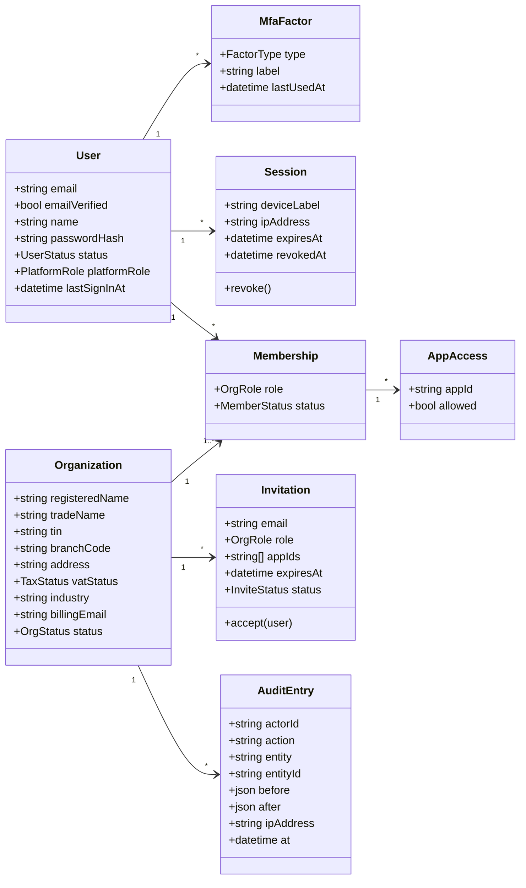
```mermaid
classDiagram
  direction LR
  class User {
    +string email
    +bool emailVerified
    +string name
    +string passwordHash
    +UserStatus status
    +PlatformRole platformRole
    +datetime lastSignInAt
  }
  class MfaFactor {
    +FactorType type
    +string label
    +datetime lastUsedAt
  }
  class Session {
    +string deviceLabel
    +string ipAddress
    +datetime expiresAt
    +datetime revokedAt
    +revoke()
  }
  class Organization {
    +string registeredName
    +string tradeName
    +string tin
    +string branchCode
    +string address
    +TaxStatus vatStatus
    +string industry
    +string billingEmail
    +OrgStatus status
  }
  class Membership {
    +OrgRole role
    +MemberStatus status
  }
  class AppAccess {
    +string appId
    +bool allowed
  }
  class Invitation {
    +string email
    +OrgRole role
    +string[] appIds
    +datetime expiresAt
    +InviteStatus status
    +accept(user)
  }
  class AuditEntry {
    +string actorId
    +string action
    +string entity
    +string entityId
    +json before
    +json after
    +string ipAddress
    +datetime at
  }
  User "1" --> "*" MfaFactor
  User "1" --> "*" Session
  User "1" --> "*" Membership
  Organization "1" --> "1..*" Membership
  Membership "1" --> "*" AppAccess
  Organization "1" --> "*" Invitation
  Organization "1" --> "*" AuditEntry
```

### 4.2 Catalog, subscriptions and entitlements

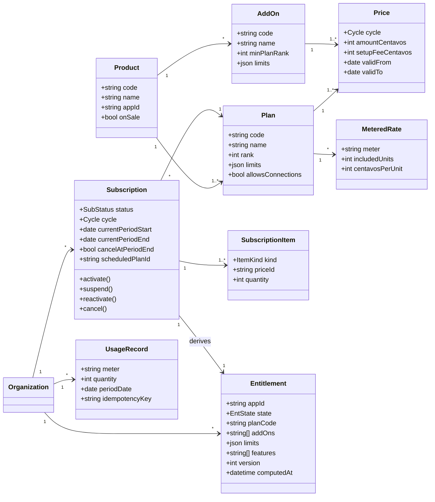
```mermaid
classDiagram
  direction LR
  class Product {
    +string code
    +string name
    +string appId
    +bool onSale
  }
  class Plan {
    +string code
    +string name
    +int rank
    +json limits
    +bool allowsConnections
  }
  class Price {
    +Cycle cycle
    +int amountCentavos
    +int setupFeeCentavos
    +date validFrom
    +date validTo
  }
  class AddOn {
    +string code
    +string name
    +int minPlanRank
    +json limits
  }
  class MeteredRate {
    +string meter
    +int includedUnits
    +int centavosPerUnit
  }
  class Subscription {
    +SubStatus status
    +Cycle cycle
    +date currentPeriodStart
    +date currentPeriodEnd
    +bool cancelAtPeriodEnd
    +string scheduledPlanId
    +activate()
    +suspend()
    +reactivate()
    +cancel()
  }
  class SubscriptionItem {
    +ItemKind kind
    +string priceId
    +int quantity
  }
  class Entitlement {
    +string appId
    +EntState state
    +string planCode
    +string[] addOns
    +json limits
    +string[] features
    +int version
    +datetime computedAt
  }
  class UsageRecord {
    +string meter
    +int quantity
    +date periodDate
    +string idempotencyKey
  }
  Product "1" --> "1..*" Plan
  Plan "1" --> "1..*" Price
  Product "1" --> "*" AddOn
  AddOn "1" --> "1..*" Price
  Plan "1" --> "*" MeteredRate
  Organization "1" --> "*" Subscription
  Subscription "*" --> "1" Plan
  Subscription "1" --> "1..*" SubscriptionItem
  Organization "1" --> "*" Entitlement
  Subscription "1" --> "1" Entitlement : derives
  Organization "1" --> "*" UsageRecord
```

### 4.3 Statements, payments and withholding

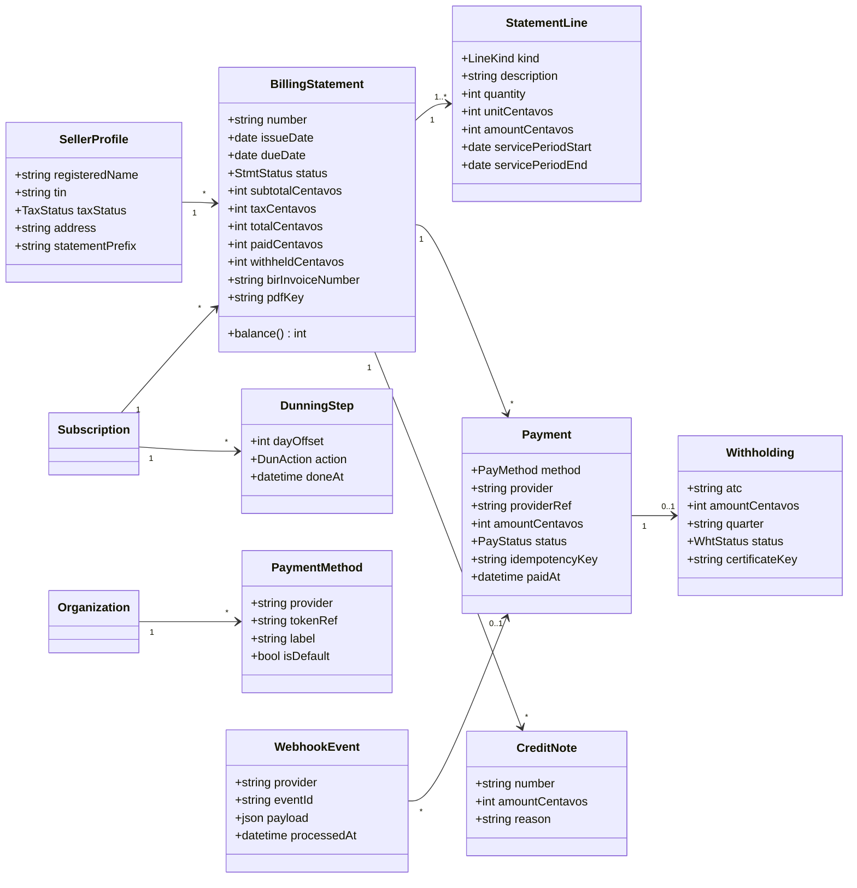
```mermaid
classDiagram
  direction LR
  class SellerProfile {
    +string registeredName
    +string tin
    +TaxStatus taxStatus
    +string address
    +string statementPrefix
  }
  class BillingStatement {
    +string number
    +date issueDate
    +date dueDate
    +StmtStatus status
    +int subtotalCentavos
    +int taxCentavos
    +int totalCentavos
    +int paidCentavos
    +int withheldCentavos
    +string birInvoiceNumber
    +string pdfKey
    +balance() int
  }
  class StatementLine {
    +LineKind kind
    +string description
    +int quantity
    +int unitCentavos
    +int amountCentavos
    +date servicePeriodStart
    +date servicePeriodEnd
  }
  class Payment {
    +PayMethod method
    +string provider
    +string providerRef
    +int amountCentavos
    +PayStatus status
    +string idempotencyKey
    +datetime paidAt
  }
  class PaymentMethod {
    +string provider
    +string tokenRef
    +string label
    +bool isDefault
  }
  class Withholding {
    +string atc
    +int amountCentavos
    +string quarter
    +WhtStatus status
    +string certificateKey
  }
  class CreditNote {
    +string number
    +int amountCentavos
    +string reason
  }
  class DunningStep {
    +int dayOffset
    +DunAction action
    +datetime doneAt
  }
  class WebhookEvent {
    +string provider
    +string eventId
    +json payload
    +datetime processedAt
  }
  SellerProfile "1" --> "*" BillingStatement
  Subscription "1" --> "*" BillingStatement
  BillingStatement "1" --> "1..*" StatementLine
  BillingStatement "1" --> "*" Payment
  Payment "1" --> "0..1" Withholding
  Organization "1" --> "*" PaymentMethod
  BillingStatement "1" --> "*" CreditNote
  Subscription "1" --> "*" DunningStep
  WebhookEvent "*" --> "0..1" Payment
```

### 4.4 Apps, connections, events and hosting

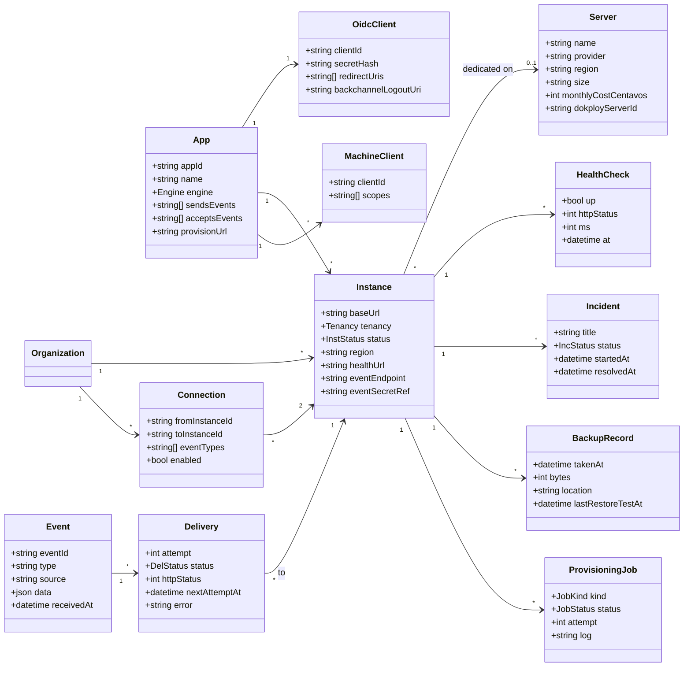
```mermaid
classDiagram
  direction LR
  class App {
    +string appId
    +string name
    +Engine engine
    +string[] sendsEvents
    +string[] acceptsEvents
    +string provisionUrl
  }
  class OidcClient {
    +string clientId
    +string secretHash
    +string[] redirectUris
    +string backchannelLogoutUri
  }
  class Instance {
    +string baseUrl
    +Tenancy tenancy
    +InstStatus status
    +string region
    +string healthUrl
    +string eventEndpoint
    +string eventSecretRef
  }
  class Server {
    +string name
    +string provider
    +string region
    +string size
    +int monthlyCostCentavos
    +string dokployServerId
  }
  class Connection {
    +string fromInstanceId
    +string toInstanceId
    +string[] eventTypes
    +bool enabled
  }
  class Event {
    +string eventId
    +string type
    +string source
    +json data
    +datetime receivedAt
  }
  class Delivery {
    +int attempt
    +DelStatus status
    +int httpStatus
    +datetime nextAttemptAt
    +string error
  }
  class MachineClient {
    +string clientId
    +string[] scopes
  }
  class HealthCheck {
    +bool up
    +int httpStatus
    +int ms
    +datetime at
  }
  class Incident {
    +string title
    +IncStatus status
    +datetime startedAt
    +datetime resolvedAt
  }
  class BackupRecord {
    +datetime takenAt
    +int bytes
    +string location
    +datetime lastRestoreTestAt
  }
  class ProvisioningJob {
    +JobKind kind
    +JobStatus status
    +int attempt
    +string log
  }
  App "1" --> "1" OidcClient
  App "1" --> "*" Instance
  Organization "1" --> "*" Instance
  Instance "*" --> "0..1" Server : dedicated on
  Organization "1" --> "*" Connection
  Connection "*" --> "2" Instance
  Event "1" --> "*" Delivery
  Delivery "*" --> "1" Instance : to
  App "1" --> "*" MachineClient
  Instance "1" --> "*" HealthCheck
  Instance "1" --> "*" Incident
  Instance "1" --> "*" BackupRecord
  Instance "1" --> "*" ProvisioningJob
```

### 4.5 Features and paywall

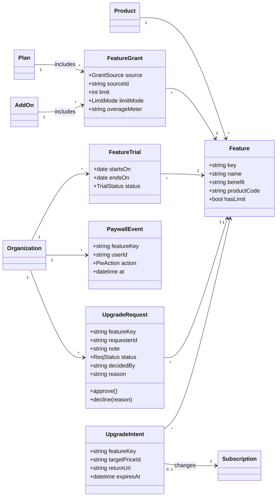
```mermaid
classDiagram
  direction LR
  class Feature {
    +string key
    +string name
    +string benefit
    +string productCode
    +bool hasLimit
  }
  class FeatureGrant {
    +GrantSource source
    +string sourceId
    +int limit
    +LimitMode limitMode
    +string overageMeter
  }
  class FeatureTrial {
    +date startsOn
    +date endsOn
    +TrialStatus status
  }
  class UpgradeRequest {
    +string featureKey
    +string requesterId
    +string note
    +ReqStatus status
    +string decidedBy
    +string reason
    +approve()
    +decline(reason)
  }
  class PaywallEvent {
    +string featureKey
    +string userId
    +PwAction action
    +datetime at
  }
  class UpgradeIntent {
    +string featureKey
    +string targetPriceId
    +string returnUrl
    +datetime expiresAt
  }
  Product "1" --> "*" Feature
  Plan "1" --> "*" FeatureGrant : includes
  AddOn "1" --> "*" FeatureGrant : includes
  FeatureGrant "*" --> "1" Feature
  Organization "1" --> "*" FeatureTrial
  FeatureTrial "*" --> "1" Feature
  Organization "1" --> "*" UpgradeRequest
  UpgradeRequest "*" --> "1" Feature
  Organization "1" --> "*" PaywallEvent
  UpgradeIntent "*" --> "1" Feature
  UpgradeIntent "0..1" --> "1" Subscription : changes
```

The entitlement's `features` list is computed from the plan's and add-ons' grants, active trials and staff overrides; each entry keeps its source so the billing page can show why a feature is on.

### 4.6 Enumerations

| Enum | Values |
|---|---|
| UserStatus | UNVERIFIED, ACTIVE, LOCKED, DISABLED |
| PlatformRole | NONE, PLATFORM_ADMIN, SUPPORT |
| FactorType | TOTP, PASSKEY, RECOVERY_CODES |
| OrgRole | OWNER, ADMIN, BILLING, MEMBER |
| OrgStatus | ACTIVE, SUSPENDED, CLOSED |
| TaxStatus | VAT, NON_VAT |
| Cycle | MONTHLY, ANNUAL, ONE_TIME |
| SubStatus | PENDING, ACTIVE, PAST_DUE, SUSPENDED, CANCELLED, EXPIRED |
| ItemKind | PLAN, ADD_ON, SETUP_FEE |
| EntState | ACTIVE, READ_ONLY, OFF |
| StmtStatus | DRAFT, OPEN, PARTIALLY_PAID, PAID, VOID |
| LineKind | SETUP_FEE, PLAN, ADD_ON, USAGE, PRORATION, ADJUSTMENT |
| PayMethod | CARD, GCASH, MAYA, BANK_TRANSFER, CASH, CREDIT |
| PayStatus | PENDING, SUCCEEDED, FAILED, REFUNDED, PARTIALLY_REFUNDED |
| WhtStatus | PENDING, RECEIVED, REJECTED, BILLED |
| DunAction | REMIND, SUSPEND, CANCEL |
| Engine | PYTHON_FRAMEWORK, TYPESCRIPT_KIT |
| Tenancy | SHARED, DEDICATED |
| InstStatus | PROVISIONING, ACTIVE, READ_ONLY, FAILED, EXPORTING, DELETED |
| DelStatus | PENDING, DELIVERED, RETRYING, FAILED, NOT_DELIVERED |
| IncStatus | OPEN, MONITORING, RESOLVED |
| JobKind | PROVISION, EXPORT, DELETE, SUSPEND, RESUME |
| JobStatus | QUEUED, RUNNING, DONE, FAILED |
| GrantSource | PLAN, ADD_ON, TRIAL, OVERRIDE |
| LimitMode | SOFT, HARD, OVERAGE |
| TrialStatus | ACTIVE, ENDED, CONVERTED |
| ReqStatus | OPEN, APPROVED, DECLINED, EXPIRED |
| PwAction | SHOWN, UPGRADE_CLICKED, REQUESTED, PURCHASED |

---

## 5. Activity Diagrams

Lanes show who acts. Diamonds are decisions.

### 5.1 Sign up and create an organization (UC-01)

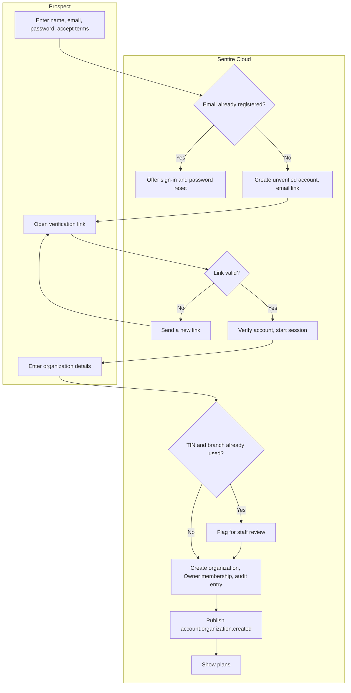
```mermaid
flowchart TD
  subgraph P[Prospect]
    A1[Enter name, email, password; accept terms]
    A4[Open verification link]
    A6[Enter organization details]
  end
  subgraph S[Sentire Cloud]
    B1{Email already registered?}
    B2[Offer sign-in and password reset]
    B3[Create unverified account, email link]
    B5{Link valid?}
    B5a[Send a new link]
    B6[Verify account, start session]
    B7{TIN and branch already used?}
    B8[Flag for staff review]
    B9[Create organization, Owner membership, audit entry]
    B10[Publish account.organization.created]
    B11[Show plans]
  end
  A1 --> B1
  B1 -- Yes --> B2
  B1 -- No --> B3 --> A4 --> B5
  B5 -- No --> B5a --> A4
  B5 -- Yes --> B6 --> A6 --> B7
  B7 -- Yes --> B8 --> B9
  B7 -- No --> B9
  B9 --> B10 --> B11
```

### 5.2 Single sign-on into an app (UC-02)

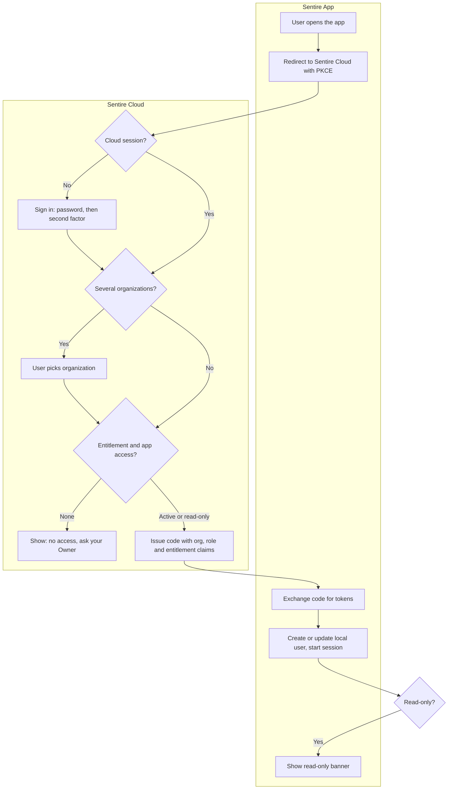
```mermaid
flowchart TD
  subgraph A[Sentire App]
    A1[User opens the app]
    A2[Redirect to Sentire Cloud with PKCE]
    A7[Exchange code for tokens]
    A8[Create or update local user, start session]
    A9[Show read-only banner]
  end
  subgraph C[Sentire Cloud]
    C1{Cloud session?}
    C2[Sign in: password, then second factor]
    C3{Several organizations?}
    C4[User picks organization]
    C5{Entitlement and app access?}
    C6[Show: no access, ask your Owner]
    C7[Issue code with org, role and entitlement claims]
  end
  A1 --> A2 --> C1
  C1 -- No --> C2 --> C3
  C1 -- Yes --> C3
  C3 -- Yes --> C4 --> C5
  C3 -- No --> C5
  C5 -- None --> C6
  C5 -- Active or read-only --> C7 --> A7 --> A8
  A8 --> D1{Read-only?}
  D1 -- Yes --> A9
```

### 5.3 Subscribe and provision (UC-04)

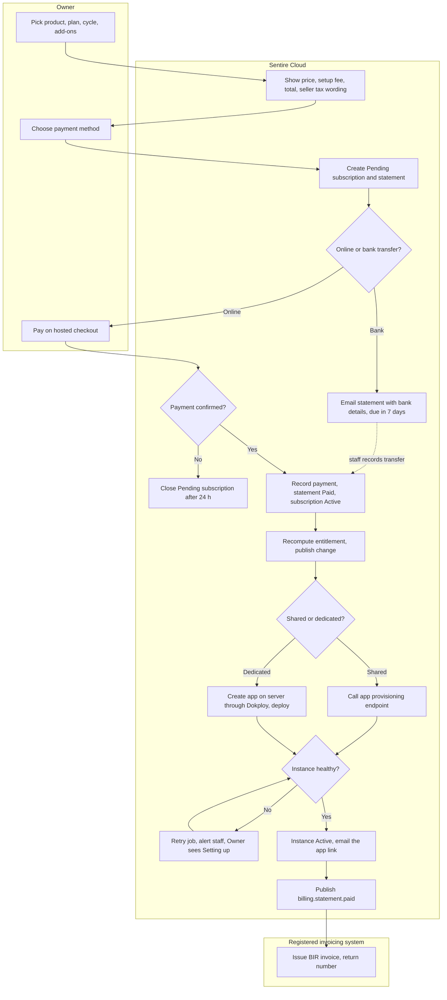
```mermaid
flowchart TD
  subgraph O[Owner]
    O1[Pick product, plan, cycle, add-ons]
    O2[Choose payment method]
    O3[Pay on hosted checkout]
  end
  subgraph C[Sentire Cloud]
    C1[Show price, setup fee, total, seller tax wording]
    C2[Create Pending subscription and statement]
    C3{Online or bank transfer?}
    C4[Email statement with bank details, due in 7 days]
    C5{Payment confirmed?}
    C6[Close Pending subscription after 24 h]
    C7[Record payment, statement Paid, subscription Active]
    C8[Recompute entitlement, publish change]
    C9{Shared or dedicated?}
    C10[Call app provisioning endpoint]
    C11[Create app on server through Dokploy, deploy]
    C12{Instance healthy?}
    C13[Retry job, alert staff, Owner sees Setting up]
    C14[Instance Active, email the app link]
    C15[Publish billing.statement.paid]
  end
  subgraph I[Registered invoicing system]
    I1[Issue BIR invoice, return number]
  end
  O1 --> C1 --> O2 --> C2 --> C3
  C3 -- Bank --> C4
  C3 -- Online --> O3 --> C5
  C4 -. staff records transfer .-> C7
  C5 -- No --> C6
  C5 -- Yes --> C7 --> C8 --> C9
  C9 -- Shared --> C10 --> C12
  C9 -- Dedicated --> C11 --> C12
  C12 -- No --> C13 --> C12
  C12 -- Yes --> C14 --> C15 --> I1
```

### 5.4 Renewal and collection (UC-06)

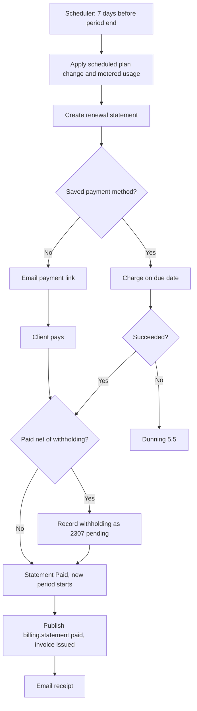
```mermaid
flowchart TD
  R1[Scheduler: 7 days before period end] --> R2[Apply scheduled plan change and metered usage]
  R2 --> R3[Create renewal statement]
  R3 --> D1{Saved payment method?}
  D1 -- Yes --> R4[Charge on due date]
  D1 -- No --> R5[Email payment link]
  R5 --> R6[Client pays]
  R4 --> D2{Succeeded?}
  R6 --> D3{Paid net of withholding?}
  D2 -- Yes --> D3
  D2 -- No --> R7[Dunning 5.5]
  D3 -- Yes --> R8[Record withholding as 2307 pending]
  D3 -- No --> R9
  R8 --> R9[Statement Paid, new period starts]
  R9 --> R10[Publish billing.statement.paid, invoice issued]
  R10 --> R11[Email receipt]
```

### 5.5 Failed payment and dunning (UC-07)

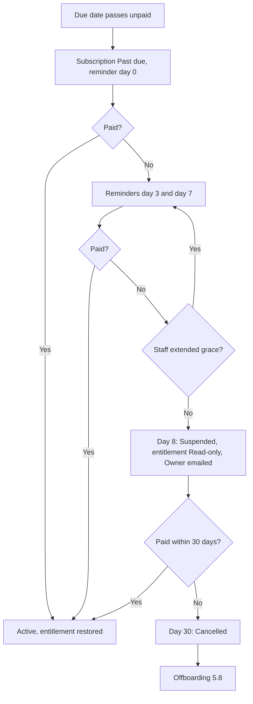
```mermaid
flowchart TD
  D0[Due date passes unpaid] --> S1[Subscription Past due, reminder day 0]
  S1 --> Q1{Paid?}
  Q1 -- Yes --> OK[Active, entitlement restored]
  Q1 -- No --> S2[Reminders day 3 and day 7]
  S2 --> Q2{Paid?}
  Q2 -- Yes --> OK
  Q2 -- No --> Q3{Staff extended grace?}
  Q3 -- Yes --> S2
  Q3 -- No --> S3[Day 8: Suspended, entitlement Read-only, Owner emailed]
  S3 --> Q4{Paid within 30 days?}
  Q4 -- Yes --> OK
  Q4 -- No --> S4[Day 30: Cancelled]
  S4 --> S5[Offboarding 5.8]
```

### 5.6 Withholding certificate (UC-08)

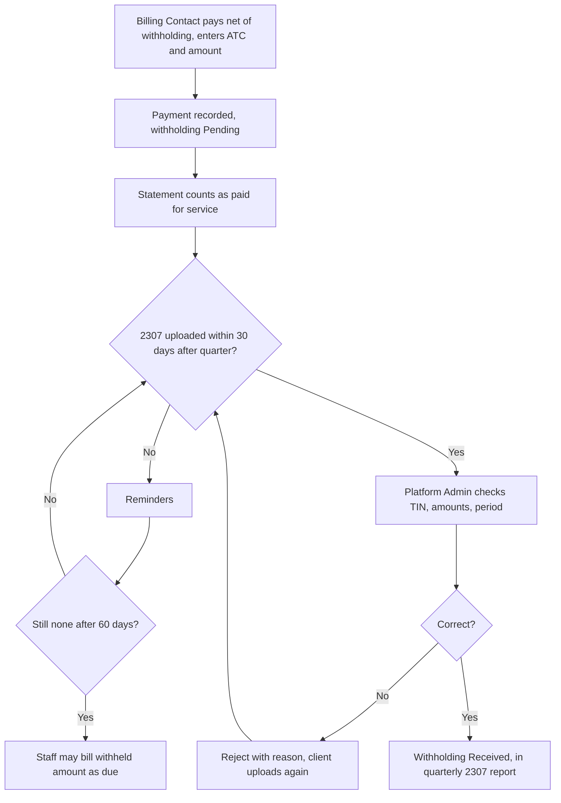
```mermaid
flowchart TD
  W1[Billing Contact pays net of withholding, enters ATC and amount] --> W2[Payment recorded, withholding Pending]
  W2 --> W3[Statement counts as paid for service]
  W3 --> Q1{2307 uploaded within 30 days after quarter?}
  Q1 -- No --> W4[Reminders]
  W4 --> Q2{Still none after 60 days?}
  Q2 -- Yes --> W5[Staff may bill withheld amount as due]
  Q2 -- No --> Q1
  Q1 -- Yes --> W6[Platform Admin checks TIN, amounts, period]
  W6 --> Q3{Correct?}
  Q3 -- No --> W7[Reject with reason, client uploads again]
  W7 --> Q1
  Q3 -- Yes --> W8[Withholding Received, in quarterly 2307 report]
```

### 5.7 Event routing between apps (UC-10)

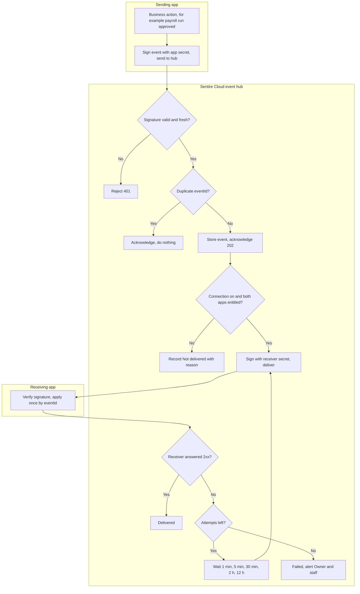
```mermaid
flowchart TD
  subgraph S[Sending app]
    E1[Business action, for example payroll run approved]
    E2[Sign event with app secret, send to hub]
  end
  subgraph H[Sentire Cloud event hub]
    H1{Signature valid and fresh?}
    H2[Reject 401]
    H3{Duplicate eventId?}
    H4[Acknowledge, do nothing]
    H5[Store event, acknowledge 202]
    H6{Connection on and both apps entitled?}
    H7[Record Not delivered with reason]
    H8[Sign with receiver secret, deliver]
    H9{Receiver answered 2xx?}
    H10[Delivered]
    H11{Attempts left?}
    H12[Wait 1 min, 5 min, 30 min, 2 h, 12 h]
    H13[Failed, alert Owner and staff]
  end
  subgraph R[Receiving app]
    R1[Verify signature, apply once by eventId]
  end
  E1 --> E2 --> H1
  H1 -- No --> H2
  H1 -- Yes --> H3
  H3 -- Yes --> H4
  H3 -- No --> H5 --> H6
  H6 -- No --> H7
  H6 -- Yes --> H8 --> R1 --> H9
  H9 -- Yes --> H10
  H9 -- No --> H11
  H11 -- Yes --> H12 --> H8
  H11 -- No --> H13
```

### 5.8 Cancel and offboard (UC-12)

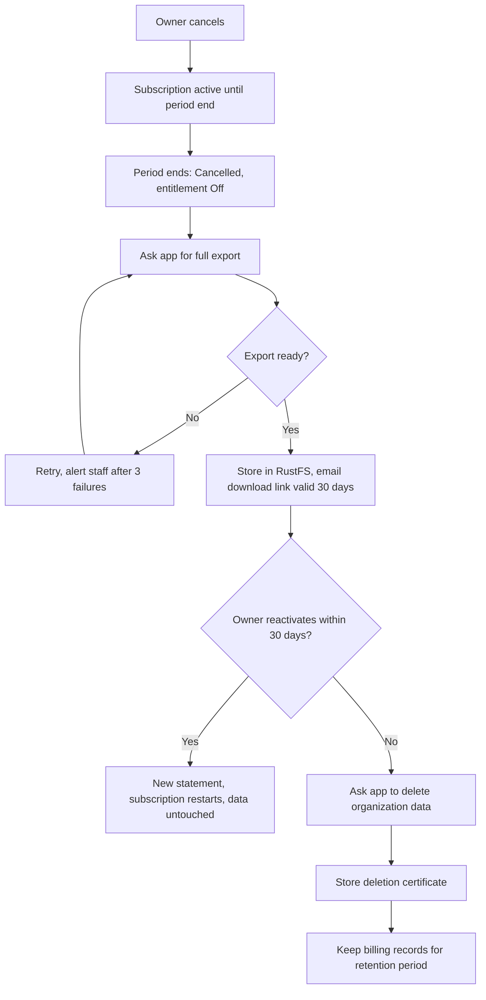
```mermaid
flowchart TD
  X1[Owner cancels] --> X2[Subscription active until period end]
  X2 --> X3[Period ends: Cancelled, entitlement Off]
  X3 --> X4[Ask app for full export]
  X4 --> Q1{Export ready?}
  Q1 -- No --> X5[Retry, alert staff after 3 failures]
  X5 --> X4
  Q1 -- Yes --> X6[Store in RustFS, email download link valid 30 days]
  X6 --> Q2{Owner reactivates within 30 days?}
  Q2 -- Yes --> X7[New statement, subscription restarts, data untouched]
  Q2 -- No --> X8[Ask app to delete organization data]
  X8 --> X9[Store deletion certificate]
  X9 --> X10[Keep billing records for retention period]
```

### 5.9 Status check and incident (UC-11)

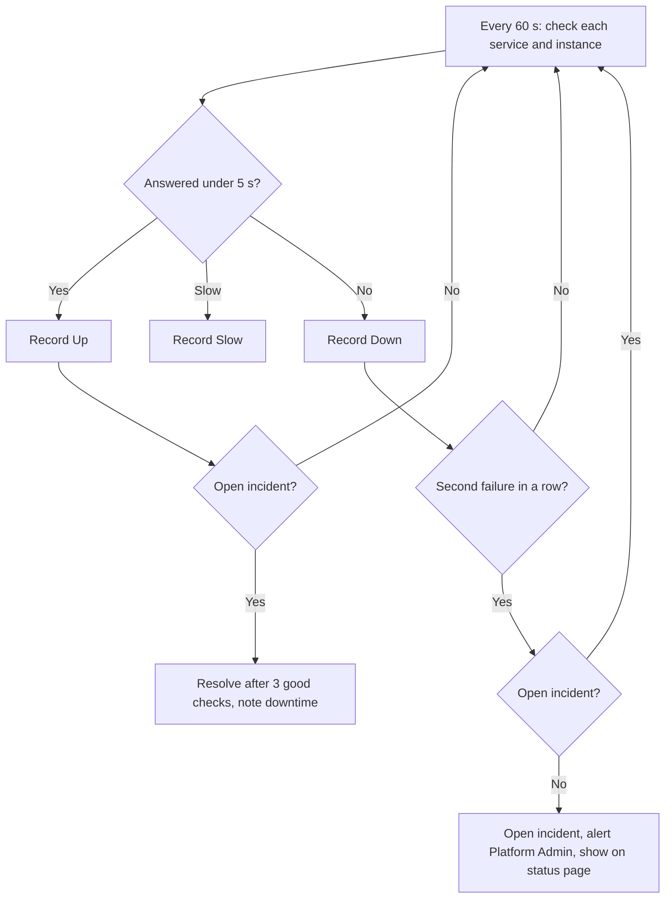
```mermaid
flowchart TD
  M1[Every 60 s: check each service and instance] --> Q1{Answered under 5 s?}
  Q1 -- Yes --> M2[Record Up]
  Q1 -- Slow --> M3[Record Slow]
  Q1 -- No --> M4[Record Down]
  M4 --> Q2{Second failure in a row?}
  Q2 -- No --> M1
  Q2 -- Yes --> Q3{Open incident?}
  Q3 -- No --> M5[Open incident, alert Platform Admin, show on status page]
  Q3 -- Yes --> M1
  M2 --> Q4{Open incident?}
  Q4 -- Yes --> M6[Resolve after 3 good checks, note downtime]
  Q4 -- No --> M1
```

### 5.10 Unlock a feature through the paywall (UC-13)

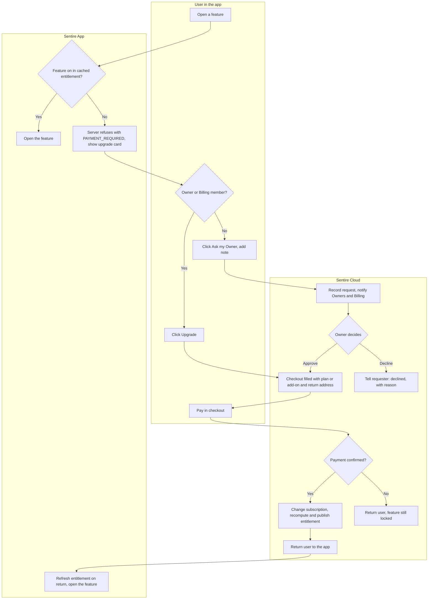
```mermaid
flowchart TD
  subgraph U[User in the app]
    U1[Open a feature]
    U2{Owner or Billing member?}
    U3[Click Upgrade]
    U4[Click Ask my Owner, add note]
    U5[Pay in checkout]
  end
  subgraph A[Sentire App]
    A1{Feature on in cached entitlement?}
    A2[Open the feature]
    A3[Server refuses with PAYMENT_REQUIRED, show upgrade card]
    A4[Refresh entitlement on return, open the feature]
  end
  subgraph C[Sentire Cloud]
    C1[Checkout filled with plan or add-on and return address]
    C2{Payment confirmed?}
    C3[Change subscription, recompute and publish entitlement]
    C4[Return user to the app]
    C5[Return user, feature still locked]
    C6[Record request, notify Owners and Billing]
    C7{Owner decides}
    C8[Tell requester: declined, with reason]
  end
  U1 --> A1
  A1 -- Yes --> A2
  A1 -- No --> A3 --> U2
  U2 -- Yes --> U3 --> C1 --> U5 --> C2
  C2 -- Yes --> C3 --> C4 --> A4
  C2 -- No --> C5
  U2 -- No --> U4 --> C6 --> C7
  C7 -- Approve --> C1
  C7 -- Decline --> C8
```

### 5.11 Usage limit check (UC-14)

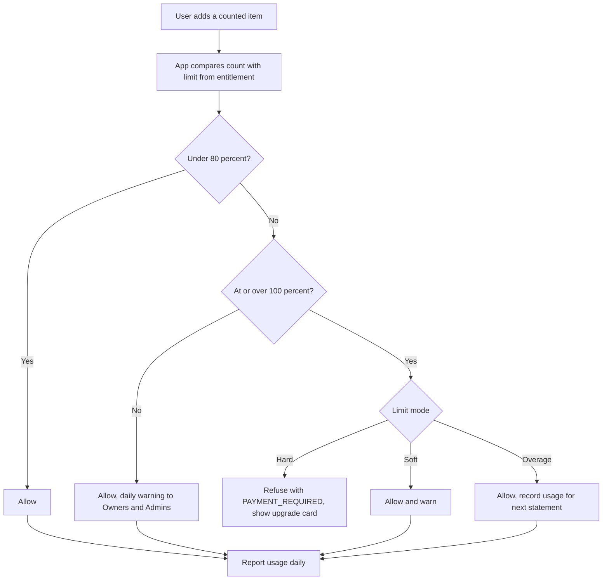
```mermaid
flowchart TD
  L1[User adds a counted item] --> L2[App compares count with limit from entitlement]
  L2 --> Q1{Under 80 percent?}
  Q1 -- Yes --> L3[Allow]
  Q1 -- No --> Q2{At or over 100 percent?}
  Q2 -- No --> L4[Allow, daily warning to Owners and Admins]
  Q2 -- Yes --> Q3{Limit mode}
  Q3 -- Hard --> L5[Refuse with PAYMENT_REQUIRED, show upgrade card]
  Q3 -- Soft --> L6[Allow and warn]
  Q3 -- Overage --> L7[Allow, record usage for next statement]
  L3 --> L8[Report usage daily]
  L4 --> L8
  L6 --> L8
  L7 --> L8
```

---

## 6. Supporting Views

### 6.1 Subscription state machine

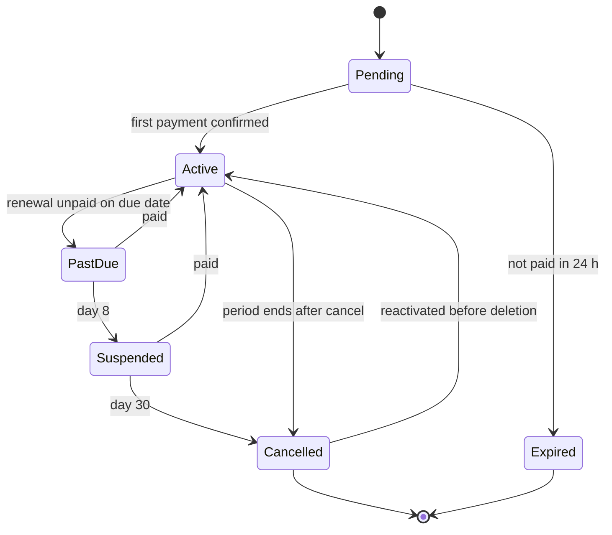
```mermaid
stateDiagram-v2
  [*] --> Pending
  Pending --> Active : first payment confirmed
  Pending --> Expired : not paid in 24 h
  Active --> PastDue : renewal unpaid on due date
  PastDue --> Active : paid
  PastDue --> Suspended : day 8
  Suspended --> Active : paid
  Suspended --> Cancelled : day 30
  Active --> Cancelled : period ends after cancel
  Cancelled --> Active : reactivated before deletion
  Cancelled --> [*]
  Expired --> [*]
```

### 6.2 Entitlement state by subscription state

| Subscription | Entitlement | What the app does |
|---|---|---|
| Pending | Off | No access |
| Active | Active | Full access within limits |
| Past due | Active | Full access, billing banner for Owners |
| Suspended | Read-only | Sign-in and reading allowed, no writes, banner for everyone |
| Cancelled | Off | No sign-in; export available to the Owner |

### 6.3 Deployment view

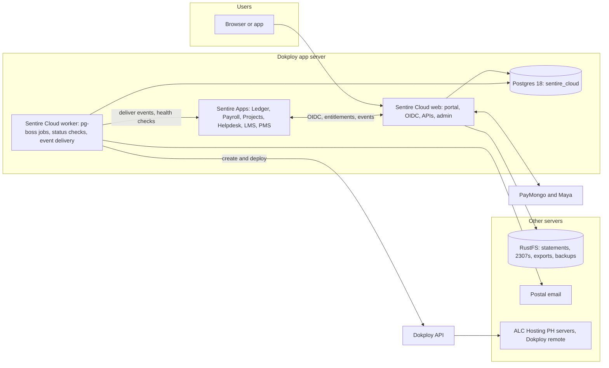
```mermaid
flowchart LR
  subgraph Clients[Users]
    B[Browser or app]
  end
  subgraph Dokploy[Dokploy app server]
    WEB[Sentire Cloud web: portal, OIDC, APIs, admin]
    WRK[Sentire Cloud worker: pg-boss jobs, status checks, event delivery]
    PG[(Postgres 18: sentire_cloud)]
    APPS[Sentire Apps: Ledger, Payroll, Projects, Helpdesk, LMS, PMS]
  end
  subgraph Other[Other servers]
    RS[(RustFS: statements, 2307s, exports, backups)]
    POST[Postal email]
    ALC[ALC Hosting PH servers, Dokploy remote]
  end
  B --> WEB
  APPS <-->|OIDC, entitlements, events| WEB
  WEB --> PG
  WRK --> PG
  WRK -->|deliver events, health checks| APPS
  WRK -->|create and deploy| DOKAPI[Dokploy API]
  DOKAPI --> ALC
  WEB --> RS
  WRK --> POST
  WEB <--> PAY[PayMongo and Maya]
```

### 6.4 Key design rules

1. **Sentire Cloud holds who and what is paid for, never the client's business data.** Books, payroll, tickets and bookings stay in each app's own database.
2. **One identity, local profiles.** The OIDC `sub` is the user's permanent ID across apps. Each app keeps a local user row keyed by `sub` and its own app roles.
3. **Entitlement is derived, never typed in.** It is computed from the subscription, plan, add-ons and staff overrides, versioned, and published on every change.
4. **Apps fail safe.** If Sentire Cloud is down, apps keep their last known entitlement and existing sessions; they never delete data because of a missing answer.
5. **Money is a ledger.** Statements, payments, credit notes and withholding are append-only; a statement's balance is the sum of its lines minus payments and withholding.
6. **Billing statement is not the BIR invoice** until Sentire Cloud itself is registered (CR-01).
7. **Every external effect is idempotent:** payment webhooks by provider event ID, events by `eventId`, provisioning by job ID, usage by idempotency key.
8. **Events use sentire.event.v1** (the same format as Sentire Framework and sentire-kit), with a separate signing secret per app instance, rotated without downtime by accepting two secrets during the change.
9. **Staff power is visible.** Every staff action is in the audit log, and access to client data inside an app needs the Owner's consent.
10. **IDs are ULIDs;** money is integer centavos; times are UTC, shown in Manila time.
11. **The paywall lives on the server.** Hiding a button is a courtesy; the app's server refuses a locked feature with `PAYMENT_REQUIRED` every time.
12. **Feature keys are permanent.** A key such as `ledger.bank_reconciliation` is never renamed or reused; moving a feature between plans changes grants, not keys.
13. **The paywall never takes data hostage.** Locked features and reached limits stop new work only; existing records stay readable and exportable.
